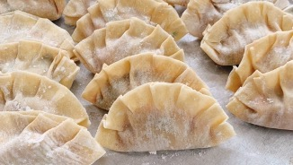

**Dumplings filled with a variety of fillings, such as cheese, potatoes, sauerkraut, or fruit.**

# **LEVEL OF DIFFICULTY:**

I would rate the difficulty of making pierogi (dumplings) as a 3 out of 5. While the process of making pierogi can be time-consuming, the steps are relatively straightforward. With a few simple ingredients, a little patience, and some practice, you can easily make delicious pierogi.

## **INGREDIENTS:**

\- 2 cups all-purpose flour 

\- 1 teaspoon salt 

\- 2 eggs 

\- 2 tablespoons butter, melted 

\- 1/2 cup water, plus more if needed 

\- 1/2 pound ground pork or beef 

\- 1 small onion, finely chopped 

\- 1 teaspoon dried marjoram 

\- 1 teaspoon garlic powder 

\- Salt and pepper to taste 

\- 1/4 cup chopped fresh parsley 

\- 1/4 cup breadcrumbs 

### **METHOD:**

1. In a large bowl, combine the flour and salt. In a separate bowl, beat the eggs, melted butter and water together. 
2. Slowly add the egg mixture to the flour mixture, stirring with a wooden spoon until the dough comes together. If the dough is too dry, add a little more water. 
3. Turn the dough out onto a floured surface and knead for about 5 minutes. Cover with a damp cloth and set aside. 
4. In a medium bowl, combine the ground pork or beef, onion, marjoram, garlic powder, salt and pepper, parsley and breadcrumbs.

**ENJOY!**