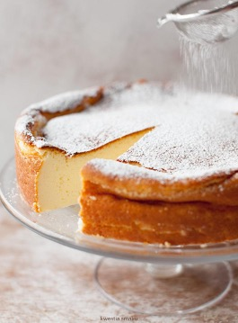

**It is a popular dish in Poland and has a unique flavor and texture.  It is often served with fresh fruit or jam.**

# **LEVEL OF DIFFICULTY:**

I would rate it a 4. Making a Polish cheesecake can be time consuming and requires a few steps, but the end result is worth the effort. The blueberry sauce adds an extra layer of complexity to the recipe, but is not overly difficult to make.

## **INGREDIENTS:**

\-Crust:

 • 3/4 cup all-purpose flour 

• 1/4 cup white sugar 

• 1/4 teaspoon salt 

• 1/4 cup butter, melted -Filling: 

• 2 (8 ounce) packages cream cheese, softened 

• 1 cup white sugar 

• 2 eggs 

• 1 teaspoon vanilla extract 

• 2 tablespoons all-purpose flour 

• 2 tablespoons lemon juice -Blueberry Sauce: 

• 2 cups fresh or frozen blueberries 

• 1/4 cup white sugar 

• 1 tablespoon lemon juice 

• 1 tablespoon cornstarch 

• 1 tablespoon cold water 

### **METHOD:**

1. Preheat oven to 350 degrees F (175 degrees C). Grease a 9 inch springform pan. 
2. To make the crust, combine the flour, sugar, and salt in a bowl. Stir in the melted butter until well blended. Press into the bottom of the prepared pan. 
3. To make the filling, beat the cream cheese in a large bowl until smooth. Gradually beat in the sugar until light and fluffy. Beat in the eggs one at a time, then stir in the vanilla, flour, and lemon juice. Pour into the prepared crust. 
4. Bake in preheated oven for 30 minutes. Allow to cool before removing from the pan. 
5. To make the blueberry sauce, combine the blueberries, sugar, and lemon juice in a saucepan over medium heat. Stir until the sugar is dissolved. In a small bowl, mix the cornstarch and water until smooth. Stir into the blueberry mixture and cook until thickened and bubbly. Serve over the cheesecake.

**ENJOY!**